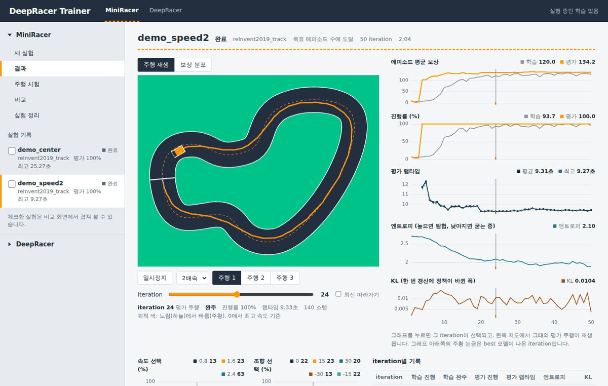
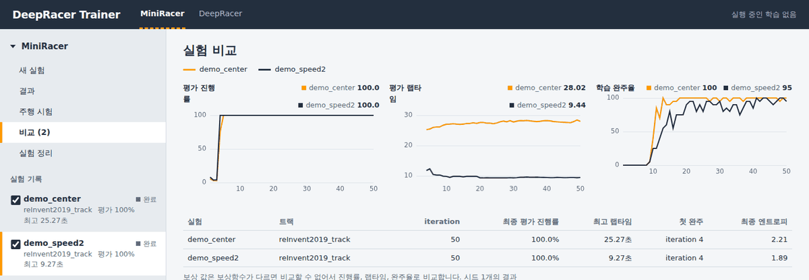
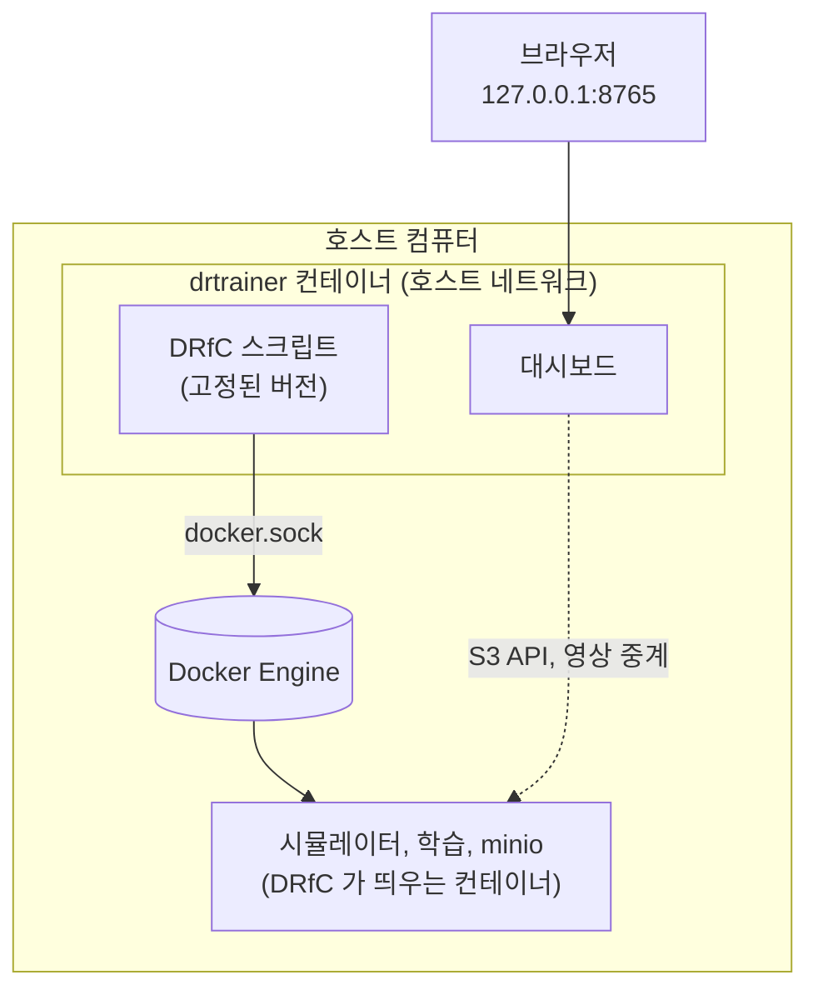
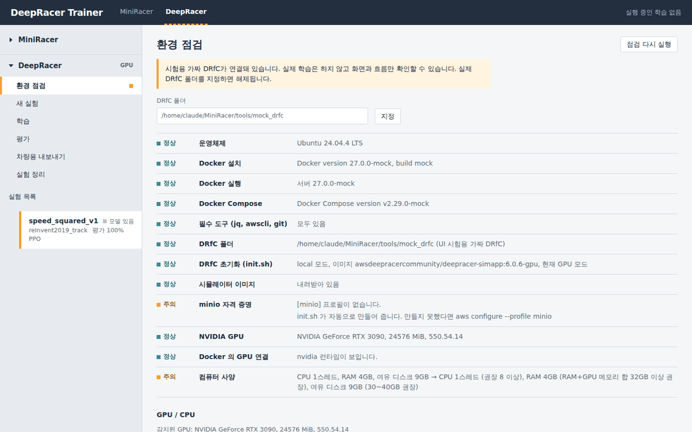
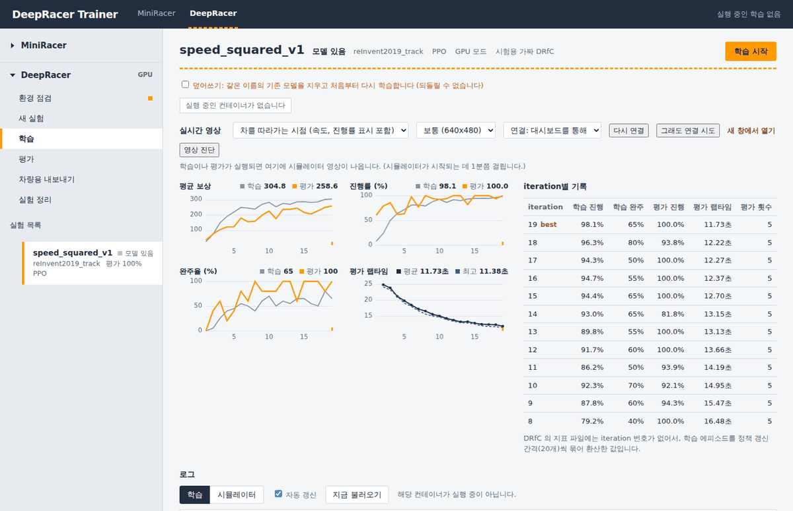
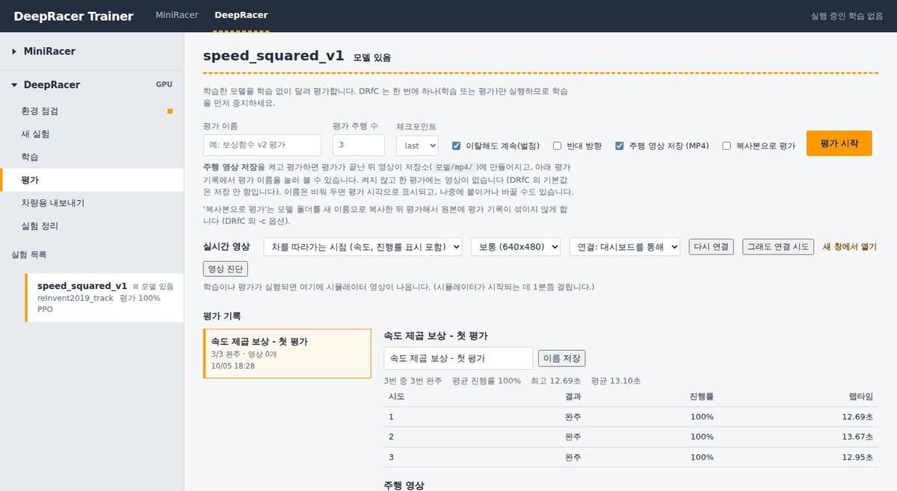

<h1 align="center">DeepRacer Trainer</h1>

<p align="center">
  <b>보상함수를 노트북에서 몇 분 안에 시험하고, 실제 DeepRacer 시뮬레이터로 학습·평가해서, 차량용 파일까지 만드는 웹 대시보드</b>
</p>

<p align="center">
  
  
  
  
</p>


## 목차

1. [전체 개요](#1-전체-개요)
2. [구성](#2-구성)
3. [MiniRacer](#3-miniracer)
4. [DeepRacer simulator](#4-deepracer-simulator)
5. [Trouble shooting](#5-trouble-shooting)
6. [출처](#6-출처)

---

## 1. 전체 개요

보상함수는 여러 번 고쳐 가며 시험해야 하는데, 실제 DeepRacer 시뮬레이터는 한 번 학습하는 데 시간이 오래 걸립니다. 이 프로젝트는 이 문제를 두 단계로 나눠서 처리합니다.

1. **MiniRacer**: 노트북에서 몇 분 안에 학습이 끝나는 2D 시뮬레이터로 보상함수 전략을 먼저 시험하고 비교합니다.
2. **DeepRacer simulator**: 정한 전략을 DRfC(DeepRacer-for-Cloud)의 실제 시뮬레이터로 학습·평가하고, 차량에 올릴 파일을 만듭니다.

두 단계는 같은 대시보드(`python dashboard.py`)에서 위쪽 탭으로 전환해서 씁니다. 보상함수 형식이 같아서, MiniRacer 에서 만든 실험을 DeepRacer 새 실험으로 가져올 수 있습니다.

---

## 2. 구성

| 구성 요소 | 하는 일 | 실행 환경 | 시작 명령 |
| --- | --- | --- | --- |
| MiniRacer | 2D 시뮬레이터에서 보상함수를 PPO 로 학습하고 평가 | Python 3.8 이상, numpy, matplotlib (GPU, Docker 불필요) | `python dashboard.py` |
| DeepRacer simulator | DRfC 로 실제 DeepRacer 시뮬레이터를 학습·평가하고 차량용 파일 생성 | Docker (Ubuntu 또는 WSL2), GPU 는 선택 | `./drtrainer up` |

| 경로 | 내용 |
| --- | --- |
| `miniracer/`, `train.py`, `play.py`, `analyze.py`, `compare.py`, `fetch_tracks.py` | MiniRacer (2D 시뮬레이터, NumPy PPO, 명령줄 도구) |
| `custom_files/`, `examples/rewards/`, `tracks/`, `runs/` | 기본 설정, 보상함수 예제, 트랙, MiniRacer 실험 결과 |
| `trainer/` | DeepRacer simulator 연동 (실험 관리, 지표, 영상 중계, S3 클라이언트) |
| `Dockerfile`, `docker-compose.yml`, `docker/`, `drtrainer` | Docker 실행 구성 |
| `scripts/` | Ubuntu 설치 스크립트(`setup_drfc.sh`), GPU 진단(`gpu_check.sh`) |
| `tools/mock_drfc/` | 시험용 가짜 DRfC. Docker 와 GPU 없이 화면만 확인할 때 사용 |
| `dashboard.py`, `web/` | 대시보드 서버와 화면 (외부 라이브러리 없음) |

---

## 3. MiniRacer

### 3.1 목적

DeepRacer 와 같은 구조(보상함수, PPO 강화학습, 평가 주행)를 2D 시뮬레이터로 구현한 것입니다. 보상함수 전략을 빠르게 시험하고 비교하는 용도입니다. 기본 설정(1000 에피소드)이 화면 없이 약 1.5분 걸립니다.

DeepRacer 와의 차이는 다음과 같습니다.

| 항목 | DeepRacer | MiniRacer |
| --- | --- | --- |
| 알고리즘 | clipped PPO, 이산 행동 | 같음 (NumPy 로 구현) |
| 설정 파일 | `reward_function.py`, `model_metadata.json`, `hyperparameters.json` | 같은 이름, `custom_files/` 폴더 |
| 보상함수 입력 | `params` 딕셔너리 | 같은 키 이름 (DeepRacer 콘솔에 그대로 붙여 넣을 수 있음) |
| 학습 단위 | iteration 단위로 정책 갱신 후 평가 | 같음 (`num_episodes_between_training`) |
| 하이퍼파라미터 | `lr`, `batch_size`, `num_epochs`, `beta_entropy`, `discount_factor`, `loss_type` | 같은 이름과 기본값 (DRfC 의 `defaults/hyperparameters.json` 과 대조. `term_cond_avg_score` 만 조기 종료를 막으려고 크게 설정) |
| 센서 | 카메라 이미지, CNN | 120도 레이 센서 13개, 작은 MLP |
| 속도·조향 입력 | 받지 않음 | 관측에 포함 (학습 속도를 높이기 위한 단순화) |
| 차량 | 실물 또는 Gazebo | 자전거 운동학 모델, 15 Hz |

센서가 다르므로 학습 속도, 안정성, 랩타임의 절대 수치는 DeepRacer 와 맞지 않습니다. 전략의 상대 비교에만 사용합니다.

### 3.2 사용방법

#### 설치와 실행

```bash
pip install -r requirements.txt     # numpy, matplotlib
python dashboard.py                 # 브라우저가 열림 (http://127.0.0.1:8765)
```

#### 대시보드 사용 순서 (MiniRacer)

1. 왼쪽 MiniRacer 그룹의 `새 실험`에서 이름, 트랙, 행동 공간(조향각 × 속도), 학습 설정, 보상함수 코드를 입력합니다. `예제에서 불러오기`로 예제 보상함수를 채울 수 있습니다.
2. `학습 시작`을 누릅니다. 학습 중에도 `결과` 화면이 갱신됩니다.
3. `결과`에서 그래프나 슬라이더로 iteration 을 고르면, 그 시점의 평가 주행이 지도에서 재생됩니다.
4. 필요하면 `주행 시험`(다른 트랙 또는 외란을 주고 주행), `비교`(왼쪽 목록에서 체크한 실험을 겹쳐 비교)를 사용합니다.

| 메뉴 | 내용 |
| --- | --- |
| 새 실험 | 실험 설정 입력, 학습 시작 |
| 결과 | 실시간 그래프, iteration 별 평가 주행 재생, 보상 분포 지도, 속도·조향 선택 비율, iteration 별 기록표, 학습 로그 |
| 주행 시험 | 학습된 모델을 다른 트랙에서 또는 외란을 주고 주행 |
| 비교 | 체크한 실험 겹쳐 비교 |
| 실험 정리 | 실험 기록(`runs/<이름>/`)을 여러 개 선택해 삭제. 확인란에 `삭제` 입력 필요 |

- 학습은 별도 프로세스(`train.py`)로 실행되므로 대시보드를 닫아도 계속됩니다. 터미널에서 실행한 학습도 `runs/` 에 저장되어 대시보드에 나타납니다.
- 보상함수에 오류가 있으면 몇 번째 줄인지 화면에 표시됩니다.
- 학습 중지는 다음 iteration 이 끝난 뒤 멈추고, 그때까지의 모델과 기록을 저장합니다.
- 동시에 3개까지 학습합니다. 코어 수가 적으면 1~2개를 권합니다.

#### 명령줄

```bash
python train.py --name my_first                                   # 학습
python train.py --reward examples/rewards/01_center_line.py --name center
python train.py --track Oval_track --name oval_test               # 트랙 지정
python play.py --run my_first                                     # 학습된 모델 주행
python play.py --run my_first --track Oval_track                  # 다른 트랙에서 주행
python play.py --run my_first --noise 1.0                         # 외란을 주고 주행
python analyze.py --run my_first                                  # 분석 리포트(report.png) 재생성
python compare.py center progress                                 # 실험 비교
```

| 명령 | 옵션 |
| --- | --- |
| `train.py` | `--name` 실험 이름 · `--track` 트랙 이름 또는 `.npy` 경로 · `--custom-files` 설정 폴더 · `--reward`, `--hp`, `--metadata` 파일 개별 지정 · `--render-every N` N iteration 마다 화면 표시 · `--no-render` · `--no-rays` · `--trace-every N` 스텝별 기록 저장 간격 · `--noise` · `--seed` · `--max-minutes` · `--list-tracks` |
| `play.py` | `--run`(필수) · `--model best\|final\|파일` · `--track` · `--laps` · `--noise` · `--no-render` · `--no-rays` · `--seed` |
| `analyze.py` | `--run`(필수) |
| `compare.py` | `실험이름...` · `--out` |
| `dashboard.py` | `--port` · `--no-browser` · `--host`(외부 접속, 아래 주의 참고) · `--strict-port` |
| `fetch_tracks.py` | `이름...`(없으면 추천 트랙) · `--list` |

`train.py` 의 주행 화면은 `--render-every`(기본 5) iteration 마다 첫 학습 에피소드를 보여 줍니다. 스페이스바로 일시정지합니다. 화면을 켜면 그만큼 느려지므로 서버에서는 `--no-render` 를 사용합니다.

#### 설정 파일

`custom_files/` 의 3개 파일입니다. `--reward`, `--hp`, `--metadata` 로 개별 지정할 수도 있습니다.

| 파일 | 내용 |
| --- | --- |
| `reward_function.py` | 기본 보상함수. 새 실험을 만들 때 처음 채워지는 코드입니다. `params` 의 키 이름이 공식 문서와 같습니다. 사용 가능한 라이브러리: `math`, `random`, `numpy`, `scipy`, `shapely` |
| `model_metadata.json` | 행동 공간 (조향각 × 속도 조합) |
| `hyperparameters.json` | PPO 하이퍼파라미터. `term_cond_max_episodes` 가 학습 길이 |

실험 결과는 `runs/<이름>/` 에 저장되며, 그 실험에 쓴 3개 파일의 사본도 함께 저장됩니다.

#### 보상함수 예제 (`examples/rewards/`)

| 파일 | 내용 |
| --- | --- |
| `01_center_line` | 중앙선만 보상. 가장 느린 속도 쪽으로 쏠려 평가 랩타임이 약 27초 |
| `02_speed_only` | 매 스텝 속도만큼 보상. 총 보상이 이동 거리에 비례하므로 빨리 달릴 이유가 생기지 않음 |
| `03_balanced` | 중앙선, 속도, 조향 억제의 가중합 |
| `04_heading_alignment` | 트랙 진행 방향과 차의 방향 정렬 (`waypoints`, `closest_waypoints`, `heading`) |
| `05_progress_steps` | 진행률과 걸린 스텝으로 빠른 주행을 직접 보상. `TOTAL_NUM_STEPS` 는 트랙마다 조정 필요 |
| `06_speed_squared` | 속도의 제곱에 비례. 같은 거리를 빨리 갈수록 총 보상이 커짐 |

각 파일 맨 위 주석에 측정 결과와 이유가 적혀 있습니다.

#### 트랙

```bash
python train.py --list-tracks
python fetch_tracks.py              # 추천 트랙 내려받기 (인터넷 필요)
```

기본 포함 트랙은 `reInvent2019_track` 하나입니다. 닫힌 루프가 아닌 트랙은 쓸 수 없고, 약 50m 이상의 긴 트랙은 학습이 오래 걸립니다. 트랙 출처의 라이선스는 [6. 출처](#6-출처)를 참고합니다.

#### 실험 비교

```bash
python train.py --reward examples/rewards/01_center_line.py --name center
python train.py --reward examples/rewards/05_progress_steps.py --name progress
python compare.py center progress
```

보상함수가 다르면 보상 값은 비교할 수 없으므로 진행률, 완주율, 랩타임으로 비교합니다. 결과는 시드 1개의 값입니다. 차이가 작으면 `--seed` 를 바꿔 반복합니다.

#### 결과 파일 (`runs/<이름>/`)

| 파일 | 내용 |
| --- | --- |
| `metrics.csv` | iteration 별 보상, 진행률, 완주율, 랩타임, 엔트로피, KL, 손실 |
| `episodes.csv` | 에피소드별 결과 (종료 사유 포함) |
| `trace_train.csv`, `trace_eval.csv` | 스텝별 기록 (위치, 속도, 조향, 행동, 보상, 진행률). `trace_train.csv` 는 `--trace-every`(기본 3) iteration 마다만 저장 |
| `model_best.npz`, `model_final.npz` | best 는 평가 진행률이 가장 높은(같으면 랩타임이 짧은) iteration |
| `status.json`, `train.log` | 대시보드가 읽는 학습 상태와 로그 |
| `report.png` | 학습 곡선, 엔트로피·KL·손실, 보상 히트맵, 구간별 속도·조향, 행동 선택 비율, 종료 사유 |

#### 참고 사항

- 하이퍼파라미터 `e_greedy_value`, `epsilon_steps`, `stack_size`, `exploration_type` 은 호환용 이름이며 사용되지 않습니다.
- 보상 크기는 내부에서 정규화됩니다. 보상함수의 절대 크기를 바꿔도 학습 속도는 달라지지 않습니다.
- 평가 주행은 확률이 가장 높은 행동만 고르고, 출발 위치를 트랙에 고르게 나눠 `min_eval_trials` 번 달립니다.
- 엔트로피는 보통 2.7(15개 행동이 균등)에서 시작해 내려갑니다. DeepRacer 의 entropy 와 해석은 같지만 수치는 비교할 수 없습니다.

### 3.3 확인방법

학습을 한 번 실행해서 동작을 확인합니다.

```bash
python train.py --name check --no-render
```

1. 약 1.5분 뒤(CPU 에 따라 다름) 마지막 줄에 `종료 사유: term_cond_max_episodes | 50 iterations, 1000 episodes, ...` 가 출력되면 정상 종료입니다.
2. `runs/check/` 에 `metrics.csv`, `episodes.csv`, `model_best.npz`, `model_final.npz`, `report.png`, `status.json`, `train.log`, `trace_*.csv` 가 생겼는지 확인합니다.
3. `python dashboard.py` 의 `결과` 화면에서 `check` 실험이 `완료` 로 보이고, 평가 진행률이 100% 로 올라가는지 확인합니다. 개발 환경 측정에서는 아래 두 예제 모두 iteration 4 에서 처음 완주(평가 진행률 100%)했습니다.
4. `python play.py --run check` 로 학습된 모델이 트랙을 도는지 확인합니다.

참고값입니다. 개발 환경에서 시드 1, 기본 설정(1000 에피소드)으로 측정한 결과이며 환경에 따라 달라집니다.

| 보상함수 | 평가 진행률 | 최고 랩타임 |
| --- | --- | --- |
| `06_speed_squared` | 100% | 9.27초 |
| `01_center_line` | 100% | 25.27초 |

두 보상함수 모두 완주하지만 랩타임이 크게 다릅니다. 두 실험을 `비교` 화면에서 겹쳐 볼 때 이 차이가 나오면 정상입니다.





---

## 4. DeepRacer simulator

### 4.1 목적

DRfC(DeepRacer-for-Cloud)의 실제 DeepRacer 시뮬레이터로 모델을 학습·평가하고, 차량에 올릴 파일을 만드는 과정을 대시보드에서 관리합니다. DRfC 의 공식 명령(`dr-upload-custom-files`, `dr-start-training -q`, `dr-stop-training`, `dr-start-evaluation -q`, `dr-create-car-zip` 등)을 호출하는 방식이며, 하나의 실험은 DRfC 의 `experiments/<이름>/` 폴더 하나에 대응합니다.

Docker 로 실행하는 경우 구성은 다음과 같습니다.



DRfC 는 호스트의 Docker 로 시뮬레이터, minio 같은 다른 컨테이너를 띄웁니다. 그래서 drtrainer 컨테이너는 다음과 같이 구성합니다.

- `docker.sock` 을 연결해 호스트의 Docker 를 사용합니다.
- DRfC 폴더와 `~/.aws` 를 호스트와 같은 절대경로로 마운트합니다. 형제 컨테이너의 bind mount 는 호스트 기준 경로로 해석되기 때문입니다.
- 호스트 네트워크를 사용합니다. DRfC 가 minio 주소를 `localhost:9000` 으로 고정하고 있습니다. 대시보드는 호스트의 `127.0.0.1` 에만 열립니다.
- 호스트와 같은 uid/gid 로 실행해서 파일 소유권을 유지합니다.

### 4.2 사용방법

#### 사전 조건

| 방식 | 조건 |
| --- | --- |
| Docker | Docker Engine, compose 플러그인 (Ubuntu: `sudo apt install docker.io docker-compose-v2`) |
| 직접 설치 | Ubuntu. 설치 스크립트가 Docker 등을 설치 |
| GPU 모드 | 호스트에 NVIDIA 드라이버와 NVIDIA Container Toolkit. 컨테이너 안으로 옮길 수 없음 (시뮬레이터를 띄우는 것이 호스트의 Docker 이기 때문) |
| Windows | WSL2 안에 설치한 Docker Engine. Docker Desktop 에서는 동작하지 않을 수 있음 |

#### 설치와 실행: Docker

```bash
chmod +x drtrainer          # Permission denied 가 나올 때 (또는 bash drtrainer up)
./drtrainer up              # 이미지 빌드, DRfC 초기화, 대시보드 시작
./drtrainer logs -f         # 진행 상황
```

처음 실행은 이미지 빌드와 시뮬레이터 이미지(수 GB) 다운로드 때문에 수 분에서 십수 분 걸립니다. 완료되면 `http://127.0.0.1:8765` 에서 대시보드가 열립니다. GPU 가 없으면 `./drtrainer up --arch cpu` 로 시작합니다. 기본값은 자동 선택이며, 호스트 Docker 에 nvidia 런타임이 있으면 GPU 모드입니다.

| 명령 | 내용 |
| --- | --- |
| `up [--arch gpu\|cpu\|auto] [--drfc-dir 경로] [--port 번호] [--rebuild]` | 시작. 이미지가 이미 있으면 다시 빌드하지 않음 |
| `down`, `restart`, `status`, `logs [-f]`, `shell` | 관리 |
| `init [--arch gpu\|cpu] [--force]` | DRfC 초기화 재시도. `system.env` 가 있으면 건너뛰고, `--force` 는 백업 후 처음부터 |
| `gpu` | GPU 진단 (아무것도 바꾸지 않음) |
| `export [--with-simapp] [폴더]` | 다른 컴퓨터로 옮길 묶음 생성 (`docker save`). `--with-simapp` 은 시뮬레이터 이미지 포함 |
| `import [폴더]` | 옮겨 온 묶음에서 이미지 로드 |

데이터는 DRfC 폴더(기본 `~/deepracer-for-cloud`: 모델, 설정, 실험)와 `./data`(MiniRacer 기록, 대시보드 상태)에 남습니다. 컨테이너를 지우거나 이미지를 다시 빌드해도 유지됩니다. 다른 컴퓨터로 옮길 때는 두 폴더를 함께 복사하고, 같은 절대경로가 되도록 `--drfc-dir` 을 지정합니다. DRfC 버전은 이미지에 고정되어 있고, `docker compose build --build-arg DRFC_COMMIT=<커밋>` 으로 바꿉니다.

#### 설치와 실행: 직접 설치 (Ubuntu)

```bash
bash scripts/setup_drfc.sh --dry-run     # 미리보기. 아무것도 변경하지 않음
sudo bash scripts/setup_drfc.sh          # 설치
pip install -r requirements.txt
python dashboard.py                      # 환경 점검에서 DRfC 폴더 지정 후 '점검 다시 실행'
```

스크립트는 Docker, (GPU 모드면) NVIDIA 컨테이너 도구, AWS CLI, DRfC 내려받기, 파이썬 환경, `init.sh` 초기화를 처리합니다.

| 옵션 | 내용 |
| --- | --- |
| `--arch gpu\|cpu` | 모드 지정 (기본: 자동 감지) |
| `--install-driver` | GPU 가 있는데 드라이버가 없을 때 NVIDIA 드라이버 설치. 설치 후 재부팅 필요 |
| `--drfc-dir 경로` | DRfC 설치 위치 (기본 `~/deepracer-for-cloud`) |
| `--user 이름` | DRfC 를 사용할 일반 사용자 (기본: sudo 를 실행한 사용자) |

- 여러 번 실행해도 됩니다. 완료된 단계는 건너뛰고 중간에 멈춘 곳부터 이어서 합니다.
- 시스템 전체 `apt upgrade`, NVIDIA 드라이버 설치, 재부팅은 기본으로 하지 않습니다.
- Ubuntu 20.04 처럼 DRfC 설치 스크립트의 지원 목록(22.04 이상)에 없는 버전은 경고만 하고 진행합니다. WSL2 에서 Docker Desktop 을 쓰면 WSL 안에 Docker 서버가 없으므로 NVIDIA 설정 단계를 건너뜁니다. WSL2 에서 `init.sh` 가 GPU 를 감지하지 못하는 DRfC 의 알려진 문제는 GPU 이미지로 설정해서 처리합니다.
- `system.env` 가 이미 있으면 `init.sh` 를 다시 실행하지 않습니다. `init.sh` 는 `system.env`, `run.env`, `custom_files/` 를 덮어쓰기 때문입니다. 단, `<DOCKER_STYLE>` 같은 자리표시자가 남은 `system.env` 는 초기화가 중간에 실패한 것으로 보고 백업한 뒤 처음부터 다시 실행합니다.
- `/tmp/sagemaker` 는 재부팅하면 사라지는데 DRfC 가 없으면 `sudo` 로 만들려 하므로, 부팅 때마다 만들어지도록 설정합니다.

#### 대시보드 사용 순서 (DeepRacer)

위쪽 `DeepRacer` 탭을 선택합니다.

1. `환경 점검`: 모든 항목이 `정상` 인지 확인합니다. 문제 항목에는 원인과 해결 방법이 표시되고, 일부는 버튼(`minio 이미지 만들기`, `swarm 만들기`)으로 해결합니다.
2. `새 실험`: 이름(모델 이름), 트랙, 알고리즘(PPO/SAC), 행동 공간, 하이퍼파라미터, 보상함수를 입력합니다. MiniRacer 실험 가져오기, 기존 실험 복제, 학습한 모델에서 이어서 학습을 선택할 수 있습니다.
3. `학습`: 시작과 중지, 컨테이너 상태, 실시간 영상, iteration 별 그래프, 로그를 확인합니다. 같은 이름의 모델이 이미 있으면 시작을 막습니다. 덮어쓰기(`-w`)는 별도로 체크하고 한 번 더 확인해야 합니다.
4. `평가`: 평가 이름과 영상 저장 옵션을 지정해 시작하고, 평가 기록에서 결과표와 영상을 확인합니다.
5. `차량용 내보내기`: `agent/model.pb` 와 `model_metadata.json` 이 든 `tar.gz` 를 만들어 내려받습니다.
6. `실험 정리`: 설정, 모델, 차량용 파일을 선택해 여러 실험을 한 번에 삭제합니다.

#### 실시간 영상

학습이나 평가가 실행 중이면 `학습`, `평가` 화면 위쪽에 시뮬레이터 영상이 표시됩니다. 시뮬레이터가 내보내는 ROS 영상 스트림(MJPEG)을 대시보드가 받아서 브라우저로 중계하므로, 브라우저는 대시보드 포트(8765)만 접속하면 됩니다. 시뮬레이터가 시작되는 데 1분 정도 걸리며, 그동안 3초마다 재연결을 시도합니다.

- 영상 종류는 시뮬레이터가 실제로 내보내고 있는 목록을 읽어서 표시합니다. 차를 따라가는 시점(속도·진행률 표시 포함), 차 안의 카메라, 표시 없는 시점, 트랙 위에서 본 시점이 있으며, 마지막 것은 `system.env` 에 `DR_CAMERA_SUB_ENABLE=True` 가 있어야 나옵니다.
- 포트는 DRfC 의 `docs/video.md` 를 따릅니다. swarm 은 학습 `8080 + 실행번호`, 평가 `8180 + 실행번호`, compose 는 워커마다 `8080~8089` 입니다. 중계는 이 컴퓨터(`127.0.0.1`)의 이 포트 범위로만 연결합니다. `연결: 직접 접속` 으로 바꾸면 브라우저가 시뮬레이터 포트에 직접 접속합니다.
- 워커가 여러 개이면 `DRfC 뷰어` 버튼으로 DRfC 자체 뷰어(`http://localhost:8100`)를 시작할 수 있습니다.
- 영상이 나오지 않으면 `영상 진단` 버튼을 사용합니다. 시뮬레이터 컨테이너와 공개 포트, 대시보드의 실행 인식 여부, 영상 서버 응답, 실제 프레임 수신, 시뮬레이터 로그, 브라우저에서의 접속 가능 여부를 순서대로 점검하고 추정 원인을 표시합니다. 결과는 복사할 수 있습니다. 실행 중으로 인식되지 않을 때는 `그래도 연결 시도` 로 직접 연결할 수 있습니다.

#### 평가 이름과 주행 영상

- 평가 시작 시 이름을 붙이거나, 끝난 평가에 나중에 붙일 수 있습니다. 이름은 `experiments/<실험>/evaluations.json` 에 저장됩니다. DRfC 는 평가 이름을 저장하지 않고 지표 파일을 `evaluation-<시각>.json` 으로만 남기므로, 대시보드가 시작 시점의 파일 목록을 기억해 두었다가 그 뒤에 생긴 파일에 이름을 연결합니다.
- 주행 영상은 `주행 영상 저장 (MP4)` 을 켠 평가에만 생깁니다. DRfC 의 기본값은 저장 안 함(`DR_EVAL_SAVE_MP4=False`)입니다. 켜면 평가 종료 후 영상 파일이 저장소의 `<모델>/mp4/` 에 만들어집니다. 켜지 않고 한 평가의 영상은 복구할 수 없으므로 다시 평가해야 합니다.
- 영상 파일 이름 규칙은 시뮬레이터가 정하며 알려져 있지 않습니다. 그래서 파일 이름이 아니라 생성 시각으로 평가와 짝지어서, 영상이 만들어진 시각과 가장 가까운 시각에 끝난 평가의 영상으로 봅니다. 10분 넘게 떨어져 있으면 짝짓지 않고 별도 목록에 둡니다.
- 영상은 저장소에서 읽어 브라우저로 전달하며 재생 위치를 옮길 수 있습니다. 브라우저는 보통 H.264 만 재생하므로, 다른 형식이면 안내가 표시되고 다운로드해서 별도 플레이어로 엽니다.
- `복사본으로 평가` 를 켜면 결과와 영상이 복사된 모델 폴더에 저장되어 평가 기록에 나타나지 않습니다.

평가 지표 파일에는 진행률이 100% 인데 `episode_status` 가 `In progress` 로 남는 행이 있습니다. 시뮬레이터가 최종 상태를 기록하지 않은 경우이며 시간이 지나도 갱신되지 않습니다. 대시보드는 다음과 같이 표시합니다.

| 지표 파일의 상태 | 화면 표시 |
| --- | --- |
| 진행률 100% 의 `In progress` | 완주로 표시하고 `*` 를 붙임. 마지막으로 기록된 시점의 시간을 랩타임으로 사용하므로 실제와 조금 다를 수 있음 |
| 진행률 100% 미만의 `In progress` | 평가 실행 중이면 `진행 중`, 끝난 뒤에는 `미완료` |
| 같은 시도의 행이 여러 개 | 마지막 행만 사용 |

#### 중지

학습이나 평가가 실행 중이면 DeepRacer 의 모든 화면 위쪽에 `중지`, `강제 중지` 버튼이 있는 배너가 표시됩니다. 오른쪽 위 상태 표시의 `중지` 를 누르면 배너로 이동합니다.

- 어떤 실험인지, 학습인지 평가인지는 컨테이너에서 알아냅니다. DRfC 스택 이름(학습 `deepracer-<번호>`, 평가 `deepracer-eval-<번호>`)과 시뮬레이터 컨테이너의 `MODEL_S3_PREFIX` 환경변수를 읽습니다. 알아내지 못하면 `(외부에서 시작됨)` 으로 표시하며, 이때도 중지할 수 있습니다.
- 종류를 알 수 없으면 `dr-stop-evaluation` 과 `dr-stop-training` 을 모두 실행한 뒤 남은 `deepracer-*` 스택과 학습·시뮬레이터 컨테이너를 직접 정리합니다.
- `강제 중지` 는 DRfC 중지 명령이 실패하거나 멈추지 않을 때 사용합니다. `deepracer-*` 스택과 `algo-*`, 시뮬레이터, 코치 컨테이너를 직접 삭제합니다. 저장된 모델과 minio 는 그대로입니다.
- 시작 직후 컨테이너가 `docker ps` 에 나타나기 전이라도 swarm 스택에 준비 중인 작업이 있으면 최대 15분까지 `시작 중` 으로 유지합니다.

#### GPU

- `환경 점검` 의 GPU / CPU 선택은 시뮬레이터 이미지 태그(`-gpu`, `-cpu`)와 `system.env` 의 `DR_SIMAPP_VERSION` 을 바꾸고 이미지를 내려받습니다. `system.env` 는 백업 후 수정하며 모델과 실험은 유지됩니다.
- `GPU 컨테이너 시험` 은 `docker run --gpus all ... nvidia-smi -L` 로 컨테이너 안에서 GPU 가 보이는지 확인합니다. 이 결과가 가장 확실한 기준입니다.
- GPU 가 여러 개면 `DR_SAGEMAKER_CUDA_DEVICES` 로, 시뮬레이터 워커 수는 `DR_WORKERS` 로 지정합니다.
- DRfC 문서의 로컬 권장 사양은 GPU 메모리 8GB 이상(워커마다 약 1GB 추가), CPU 4코어(8스레드) 이상, RAM 과 GPU 메모리 합 32GB 이상입니다.
- 처음 설치할 때의 모드는 호스트 Docker 에 nvidia 런타임이 있는지로 한 번 정해집니다. 그때 GPU 도구가 없었다면 CPU 모드로 설정되어 있으므로 아래 순서로 확인합니다.

```bash
./drtrainer gpu        # 또는 bash scripts/gpu_check.sh
```

| 막힌 곳 | 진단 결과 | 조치 |
| --- | --- | --- |
| 호스트 NVIDIA 드라이버 | `nvidia-smi` 가 안 보임 | WSL2: Windows 에 최신 NVIDIA 드라이버를 설치하고 PowerShell 에서 `wsl --shutdown` (WSL 안에는 설치하지 않음). Linux: `sudo bash scripts/setup_drfc.sh --arch gpu --install-driver` (재부팅 필요) |
| Docker 의 GPU 연결 | 드라이버는 정상인데 `could not select device driver` | `sudo bash scripts/setup_drfc.sh --arch gpu`. 완료된 단계는 건너뛰고 NVIDIA 도구 설치와 Docker 설정만 수행. Docker 가 재시작되어 실행 중인 컨테이너가 잠시 멈춤 |
| DRfC 모드 | GPU 컨테이너는 되는데 DRfC 가 `-cpu` 이미지 | `환경 점검` 에서 GPU 를 선택하고 `이 모드로 전환` |

#### minio 이미지

MinIO 가 2026-09-11 경 Docker Hub 의 `minio/minio` 이미지를 삭제했습니다. DRfC 는 학습을 시작할 때 이 이미지로 저장소를 띄우므로, 이미지가 컴퓨터에 없으면 `No such image: minio/minio:latest` 로 학습을 시작할 수 없습니다. 이 프로젝트는 GitHub 릴리스에 남아 있는 마지막 공개 바이너리(`RELEASE.2025-09-07T16-13-09Z`)를 SHA-256 으로 검증해서 같은 형태의 이미지(`minio/minio:RELEASE.2025-09-07T16-13-09Z-local`)를 직접 빌드하고(`docker/minio/Dockerfile`), `system.env` 의 `DR_MINIO_IMAGE` 를 그 태그로 바꿉니다. 원본은 `system.env.bak-*` 로 백업합니다.

- 학습·평가 시작 전, `환경 점검` 의 `minio 이미지 만들기` 버튼, 설치 스크립트, Docker 진입점이 이미지 존재를 확인하고 없으면 만듭니다. 수동 실행: `bash docker/minio-local-image.sh <DRfC 폴더>`
- 이 minio 는 더 이상 유지보수되지 않으므로 이후의 보안 취약점은 수정되지 않습니다. DRfC 는 minio 포트(9000, 9001)를 모든 네트워크 인터페이스에 열기 때문에, 신뢰할 수 있는 네트워크에서만 사용하거나 방화벽으로 막습니다.
- 바이너리는 공개된 체크섬과 대조해 손상과 변조를 확인합니다. MinIO 서명(`.minisig`)은 검증하지 않습니다.
- MinIO 는 객체를 `<키>/xl.meta` 같은 디렉터리 구조로 저장하므로 파일로 읽을 수 없습니다. 대시보드는 지표, 평가 결과, 영상을 S3 API 로 읽습니다(`~/.aws/credentials` 의 minio 프로필 사용).

#### 실험 정리

`실험 정리` 에서 여러 실험을 한 번에 삭제합니다. 되돌릴 수 없으며, 확인란에 `삭제` 를 입력해야 버튼이 활성화됩니다.

- 삭제 항목은 설정(`experiments/<이름>/`), 학습한 모델과 지표(저장소), 차량용 파일과 시뮬레이터 로그 중에서 선택합니다. 모델은 minio 데이터 폴더를 직접 지우지 않고 S3 API(`aws s3 rm`)로 삭제합니다.
- 실행 중인 실험은 선택할 수 없고, 다른 실험이 이어서 학습하는 데 쓰는 모델은 삭제되지 않습니다.
- 같은 이름으로 다시 학습하려는데 "모델이 이미 있습니다" 오류가 나면, 여기서 그 실험의 모델을 삭제합니다.

#### 보안 관련 주의

- Docker 방식의 컨테이너는 `docker.sock` 을 사용하므로 호스트 root 와 같은 권한을 가집니다. 컨테이너 안에는 DRfC 가 사용하는 `sudo` 가 비밀번호 없이 동작하도록 되어 있습니다.
- 대시보드는 입력된 보상함수 코드를 실행합니다. `--host` 로 외부 접속을 열면 같은 네트워크의 누구나 그 컴퓨터에서 코드를 실행할 수 있습니다. 인증이 없으므로 신뢰할 수 있는 컴퓨터에서 본인만 사용하는 것을 전제로 합니다.

#### 알아둘 점

- 타임 트라이얼(카메라 한 대) 기준입니다. 물체 회피와 봇 대결은 `experiments/<이름>/run.env` 와 `model_metadata.json` 을 직접 수정해야 합니다.
- 트랙 이름은 시뮬레이터 이미지에 있는 이름이어야 합니다. 목록에 없는 이름도 입력할 수 있지만 틀리면 시뮬레이터 로그에 오류가 납니다.
- 지표 파일(`TrainingMetrics.json`)에는 iteration 번호가 없어서, 학습 에피소드를 `num_episodes_between_training` 개씩 묶어 환산합니다. 추정값입니다.
- DRfC 는 한 번에 하나(학습 또는 평가)만 실행합니다. `DR_RUN_ID` 로 여러 실험을 동시에 돌리는 구성은 지원하지 않습니다.
- DRfC 폴더 구조와 명령은 2026년 8월 기준 저장소를 읽고 맞췄습니다.

### 4.3 확인방법

#### 설치 후

1. `DeepRacer` 탭의 `환경 점검` 에서 모든 항목이 `정상` 인지 확인합니다. 확인 항목은 운영체제, Docker 설치·실행, Docker Compose, 필수 도구, DRfC 폴더, DRfC 초기화, 시뮬레이터 이미지, minio 이미지, minio 자격 증명, GPU, Docker 의 GPU 연결, 컴퓨터 사양입니다. `주의` 는 동작은 가능하지만 확인이 필요한 항목입니다. `필요` 는 해결해야 하는 항목입니다.
2. GPU 모드라면 `GPU 컨테이너 시험` 을 눌러 컨테이너 안에서 GPU 가 보이는지 확인합니다.
3. 터미널에서 확인할 때:

```bash
./drtrainer status       # 컨테이너 상태, DRfC 폴더, 모드, 주소
./drtrainer gpu          # GPU 진단
docker ps                # drtrainer 컨테이너가 healthy 인지
docker node ls           # swarm 이 활성인지
```

#### 학습

1. `새 실험` 에서 학습 길이를 작게(예: `term_cond_max_episodes` 100) 한 실험을 만들고 `학습` 에서 시작합니다.
2. 컨테이너 상태 표시에 저장소(minio), 학습(Sagemaker), 시뮬레이터(RoboMaker), 코치가 모두 표시되는지 확인합니다.
3. 첫 iteration 이 끝나면 보상, 진행률, 완주율 그래프와 iteration 별 기록표가 채워집니다. iteration 은 `num_episodes_between_training`(기본 20)개 에피소드마다 끝납니다.
4. 영상 패널에 시뮬레이터 영상이 나오는지 확인합니다. 나오지 않으면 `영상 진단` 을 실행합니다.
5. 학습 중에는 어느 DeepRacer 화면에서나 위쪽에 중지 배너가 표시됩니다.

#### 평가와 내보내기

1. `평가` 에서 이름과 `주행 영상 저장 (MP4)` 을 지정해 시작합니다.
2. 평가가 끝나면 평가 기록에 이름이 표시되고, 이름을 누르면 시도별 결과(진행률, 랩타임)가 나옵니다. 영상 저장을 켰다면 주행 영상 탭이 나타납니다.
3. `차량용 내보내기` 로 만든 `tar.gz` 안에 `agent/model.pb` 와 `model_metadata.json` 이 있는지 확인합니다.

#### 화면만 확인 (Docker, GPU 없이)

`tools/mock_drfc/` 는 시험용 가짜 DRfC 입니다. 실제 학습을 하지 않고 가짜 학습 곡선을 만듭니다. `환경 점검` 에서 DRfC 폴더를 이 폴더로 지정하면 `시험용 가짜 DRfC` 표시가 나오며, DeepRacer 화면의 흐름(실험 생성, 학습, 평가, 내보내기, 중지, 실험 정리)을 확인할 수 있습니다. 실제 DRfC 로 바꾸려면 폴더를 다시 지정합니다. 아래 화면은 이 가짜 DRfC 로 찍은 것이며 그래프 값과 GPU 정보는 가짜입니다.







#### 확인 범위

| 영역 | 확인 방법 | 상태 |
| --- | --- | --- |
| MiniRacer 학습, 결과, 비교, 실험 정리 | 실제 학습 실행과 실제 브라우저 | 확인함 (Linux, Python 3.12) |
| DeepRacer 화면 전체 | 시험용 가짜 DRfC 와 실제 브라우저(Chromium) | 확인함 |
| minio 연동 (지표, 평가 결과, 영상 중계·재생 위치 이동, 삭제) | 실제 MinIO 바이너리(2022-10, 2025-09), 실제 MP4 파일 | 확인함 |
| 셸 스크립트, Dockerfile | shellcheck, hadolint, 가짜 docker 로 진입점·초기화·minio 이미지 스크립트 실행 | 확인함 |
| 실제 Docker, DRfC | 개발 중 실제 Ubuntu/WSL2 에서 이미지 실행, minio 이미지 생성, 학습·평가 결과 표시 확인 | 일부 확인. 전 과정을 자동 시험으로 검증하지는 않음 |
| 실시간 영상 | 가짜 영상 서버(ROS web_video_server 형식)로만 시험 | 실제 시뮬레이터 영상은 미확인 |
| 저장된 평가 영상(MP4) | 시각 기반 짝짓기와 재생을 가짜 파일로 시험 | 실제 파일 이름과 코덱은 미확인 |
| GPU 진단·설정 | 가짜 환경으로 여러 상황을 시뮬레이션 | 실제 NVIDIA 환경은 미확인 |
| Windows, macOS 에서 직접 실행 | 시험하지 않음 | 미확인 (Windows 는 WSL2 사용) |

---

## 5. Trouble shooting

### 5.1 `./drtrainer: Permission denied`

압축을 Windows 에서 풀거나 Windows 에서 git 으로 받으면 실행 권한이 사라집니다.

```bash
chmod +x drtrainer          # 또는 bash drtrainer up
```

### 5.2 `client version 1.52 is too new. Maximum supported API version is 1.43`

호스트 Docker 서버(예: Ubuntu 22.04 의 Docker 24, API 1.43)가 이미지 안의 docker 명령(API 1.52)보다 오래된 경우입니다. 컨테이너는 시작할 때 서버의 API 버전을 소켓에서 읽어 `DOCKER_API_VERSION` 으로 맞춰 사용합니다(Docker 문서가 안내하는 방법). 이 오류가 보이면 최신 버전으로 다시 시작합니다.

```bash
./drtrainer up --rebuild
```

적용되면 `환경 점검` 에 맞춰 쓰는 중이라는 알림이 표시됩니다. 호스트 Docker 를 업데이트하는 것이 근본적인 해결입니다.

### 5.3 `No such image: minio/minio:latest`

MinIO 가 Docker Hub 이미지를 삭제했기 때문입니다. `환경 점검` 의 `minio 이미지 만들기` 를 누르거나 `bash docker/minio-local-image.sh <DRfC 폴더>` 를 실행합니다. 학습 시작 시에도 자동으로 확인하고 만듭니다. 자세한 내용은 [minio 이미지](#minio-이미지)를 참고합니다.

### 5.4 `export DR_DOCKER_STYLE=<DOCKER_STYLE>`, `This node is not a swarm manager`

`init.sh` 가 swarm 을 만드는 단계에서 실패하면 `system.env` 는 만들어졌지만 `<DOCKER_STYLE>` 같은 값이 채워지지 않은 상태로 남습니다. 대시보드는 이 상태를 초기화 미완료로 판정하고 학습·평가 시작을 막습니다. 다음 명령이 해당 파일을 백업하고 `init.sh` 를 처음부터 다시 실행합니다.

```bash
./drtrainer init            # 직접 설치는 sudo bash scripts/setup_drfc.sh
```

정상인 파일까지 백업하고 다시 하려면 `./drtrainer init --force` 를 사용합니다.

### 5.5 swarm 만 없는 경우

`docker swarm leave` 를 했거나 Docker 를 새로 설치한 경우입니다. `환경 점검` 의 `Docker swarm` 항목에서 `swarm 만들기` 를 누릅니다(`docker swarm init`, 안 되면 기본 IP 를 지정해 재시도). 이 컴퓨터의 Docker 가 swarm 모드로 바뀌며, DRfC 가 원래 요구하는 설정입니다.

### 5.6 GPU 가 인식되지 않음, `could not select device driver`

Docker 를 다시 설치할 필요는 없습니다. `./drtrainer gpu` 로 막힌 곳을 확인하고 [GPU](#gpu)의 표대로 조치합니다.

### 5.7 실시간 영상이 나오지 않음

영상 패널의 `영상 진단` 을 실행하고 결과 전체를 확인합니다. 대시보드 포트만 접속 가능하면(SSH 터널 포함) 영상은 대시보드를 통해 전달됩니다. 시뮬레이터가 시작되는 데 1분 정도 걸립니다.

### 5.8 평가 결과가 `In progress` 로 남음

시뮬레이터가 최종 상태를 기록하지 않은 경우입니다. 진행률이 100% 면 완주(`*`)로 표시됩니다. 판정 규칙은 [평가 이름과 주행 영상](#평가-이름과-주행-영상)을 참고합니다.

### 5.9 평가 영상이 없거나 재생되지 않음

- 영상이 없음: `주행 영상 저장 (MP4)` 을 켜고 평가한 경우에만 영상이 만들어집니다. 켜지 않고 한 평가는 다시 평가해야 합니다.
- 재생되지 않음: MP4 안의 영상 형식이 브라우저가 지원하는 H.264 가 아닙니다. `다운로드` 해서 별도 플레이어로 엽니다.

### 5.10 중지 버튼이 없음, `(외부에서 시작됨)`

DeepRacer 의 모든 화면 위쪽 배너에 `중지`, `강제 중지` 가 있습니다. `중지` 로 멈추지 않으면 `강제 중지` 를 사용합니다.

### 5.11 `모델 ... 이(가) 이미 있습니다`

같은 이름으로 다시 학습하려는 경우입니다. `실험 정리` 에서 그 실험의 모델을 삭제하거나, `학습` 화면에서 `덮어쓰기` 를 체크합니다.

### 5.12 포트 8765 가 사용 중

```bash
python dashboard.py --port 9000     # Docker: ./drtrainer up --port 9000
```

### 5.13 `train.py` 에서 창이 뜨지 않음

화면이 없는 서버 등에서 발생합니다. `--no-render` 로 실행하거나 대시보드를 사용합니다.

문제가 해결되지 않으면 이슈에 `./drtrainer logs` 출력, `환경 점검` 의 실패 항목, 영상 문제라면 `영상 진단` 결과를 함께 올립니다.

---

## 6. 출처

이 프로젝트는 AWS, Amazon 과 관련 없는 비공식 도구입니다. AWS DeepRacer 는 Amazon 의 서비스입니다.

| 구성 요소 | 사용 방식 | 비고 |
| --- | --- | --- |
| [DeepRacer-for-Cloud](https://github.com/aws-deepracer-community/deepracer-for-cloud) | Docker 이미지가 고정한 커밋(`245bd7f`)을 내려받아 사용. `tools/mock_drfc/defaults/` 의 일부 파일은 이 저장소에서 복사 | 라이선스: `tools/mock_drfc/LICENSE-DRfC.txt` |
| [MinIO](https://github.com/minio/minio) | minio 이미지를 빌드할 때 GitHub 릴리스의 바이너리를 내려받음. 저장소에 바이너리는 포함하지 않음 | AGPL-3.0. 더 이상 유지보수되지 않음 |
| 트랙 (`tracks/reInvent2019_track.npy`, `fetch_tracks.py` 가 내려받는 파일) | [deepracer-race-data](https://github.com/aws-deepracer-community/deepracer-race-data) 저장소의 `raw_data/tracks/npy` | 해당 저장소에서 라이선스 파일을 찾지 못했음. 내려받는 트랙은 저장소에 포함하지 않음(`.gitignore`). 포함된 `reInvent2019_track.npy` 도 같은 출처이므로 재배포 전에 확인 필요 |
| numpy, matplotlib | MiniRacer 의 파이썬 의존성 | 각 프로젝트의 라이선스를 따름 |